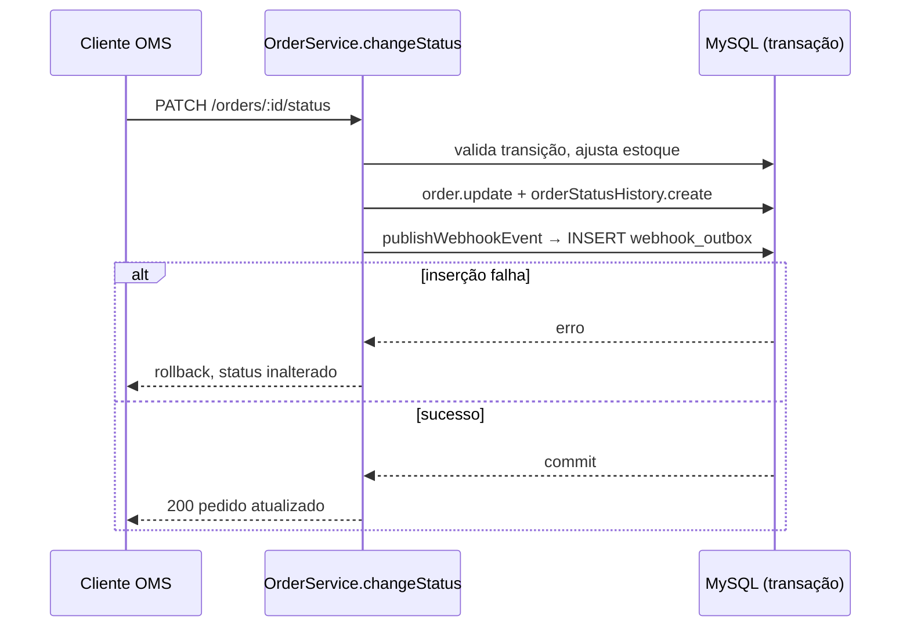

# FDD: Sistema de Webhooks de Notificação de Pedidos

| Campo | Valor |
| --- | --- |
| **Versão** | 1.0 |
| **Data** | 2026-07-26 |
| **Responsável** | Bruno (Engenheiro Pleno, time de Pedidos) |
| **Documentos relacionados** | [RFC](RFC.md) · [PRD](PRD.md) · [ADRs](adrs/) |

## 1. Contexto e motivação técnica

O OMS controla o ciclo de vida do pedido com máquina de estados, controle transacional de estoque e
auditoria de mudanças de status, mas não expõe nenhum desses eventos para fora. Clientes B2B integram
por polling em `GET /orders`.

Este documento detalha como implementar a notificação outbound por webhook. A decisão arquitetural está
fechada nos ADRs: outbox no MySQL gravada na transação de `changeStatus` ([ADR-001](adrs/ADR-001-outbox-no-mysql.md)),
worker em processo separado com polling de 2 segundos ([ADR-002](adrs/ADR-002-worker-em-processo-separado-com-polling.md)),
retry com backoff e DLQ ([ADR-003](adrs/ADR-003-retry-com-backoff-e-dead-letter-queue.md)), assinatura
HMAC-SHA256 com secret por endpoint ([ADR-004](adrs/ADR-004-autenticacao-hmac-sha256-com-secret-por-endpoint.md)),
entrega at-least-once com `X-Event-Id` ([ADR-005](adrs/ADR-005-entrega-at-least-once-com-x-event-id.md))
e reuso integral dos padrões do projeto ([ADR-006](adrs/ADR-006-reuso-dos-padroes-existentes-do-projeto.md)).

**Atores:** cliente B2B (recebe as notificações), usuário autenticado do OMS (configura os endpoints),
usuário ADMIN (reprocessa a DLQ), worker (entrega).

**Limites:** apenas outbound; a plataforma não recebe webhooks. Apenas o evento
`order.status_changed` nesta fase.

## 2. Objetivos técnicos

| # | Objetivo | Medida / invariante |
| --- | --- | --- |
| 1 | Atomicidade entre mudança de status e registro do evento | Nenhum commit de `changeStatus` sem linha correspondente em `webhook_outbox` para os status filtrados |
| 2 | Latência de enfileiramento previsível | Intervalo de polling de 2 s; espera em fila ≤ 2 s em condição normal |
| 3 | Entrega resiliente a indisponibilidade do cliente | 5 tentativas em 1m/5m/30m/2h/12h antes da DLQ |
| 4 | Autenticidade e integridade verificáveis pelo cliente | Toda requisição carrega `X-Signature` com HMAC-SHA256 do corpo |
| 5 | Nenhum evento perdido silenciosamente | Evento que esgota tentativas é persistido em `webhook_dead_letter` com motivo |
| 6 | Isolamento de falha entre entrega e API | Worker em processo próprio; falha de entrega não afeta requisições HTTP |

## 3. Escopo e exclusões

**Incluído**

- Tabelas `webhook_outbox`, `webhook_dead_letter`, configuração de endpoints e histórico de entregas
- Módulo `src/modules/webhooks` com CRUD, rotação de secret e consulta de entregas
- Publicação do evento na transação de `changeStatus`
- Worker com polling, assinatura, entrega, retry e movimentação para DLQ
- Endpoint administrativo de replay de DLQ

**Excluído**

- Notificação por e-mail ao cliente quando o endpoint falha repetidamente (adiado para fase posterior)
- Dashboard visual para o cliente (projeto do time de frontend)
- Rate limiting de saída por cliente (em aberto — [RFC-OPEN-01](RFC.md#rfc-open-01--rate-limiting-de-saída-por-cliente))
- Arquivamento de linhas entregues da outbox (fora do escopo desta feature)
- Webhooks inbound
- Eventos que não sejam mudança de status de pedido

## 4. Fluxos detalhados

### FDD-FLUXO-01 — Publicação do evento na outbox

Executado dentro da transação de `changeStatus`, após a atualização do pedido e do histórico.

1. `changeStatus` valida a transição com `canTransition` e aplica os efeitos de estoque.
2. `tx.order.update` grava o novo status; `tx.orderStatusHistory.create` grava a auditoria.
3. `publishWebhookEvent(tx, order, fromStatus, toStatus)` consulta os endpoints ativos do
   `customer_id` do pedido cujo filtro de status inclui `toStatus`.
4. Se nenhum endpoint quer aquele status, **nada é inserido** — o filtro é aplicado na inserção.
5. Para cada endpoint interessado, insere uma linha em `webhook_outbox` com `event_id` (UUID),
   `webhook_id`, `order_id`, o payload **já renderizado** (snapshot) e status `PENDENTE`.
6. Qualquer falha nessa inserção propaga a exceção e derruba a transação inteira: o status não muda.



### FDD-FLUXO-02 — Processamento pelo worker

Loop contínuo no processo iniciado por `npm run worker`.

1. A cada 2 segundos, seleciona os eventos `PENDENTE` mais antigos, em batch pequeno, ordenados por
   `created_at`, com `next_attempt_at` nulo ou já vencido.
2. Marca cada evento como `PROCESSANDO`.
3. Monta o corpo a partir do payload em snapshot e calcula a assinatura HMAC-SHA256 com a secret vigente
   do endpoint.
4. Envia `POST` para a URL cadastrada, com timeout de 10 segundos.
5. Resposta `2xx`: marca `ENTREGUE`, registra o delivery com duração e corpo da resposta.
6. Resposta fora de `2xx`, erro de rede ou timeout: aplica FDD-FLUXO-03.

### FDD-FLUXO-03 — Retry com backoff

1. Incrementa `attempt_count` do evento.
2. Se `attempt_count < 5`: volta o evento para `PENDENTE` e define `next_attempt_at` conforme a
   progressão 1 min → 5 min → 30 min → 2 h → 12 h, contada a partir da falha.
3. Se `attempt_count = 5`: aplica FDD-FLUXO-04.
4. Cada tentativa registra uma linha no histórico de entregas, com resultado, status HTTP e duração.

### FDD-FLUXO-04 — Movimentação para a DLQ

1. Insere em `webhook_dead_letter` o payload, o `webhook_id`, o motivo da última falha e o timestamp.
2. Marca o evento na outbox como `FALHOU`.
3. Nenhuma tentativa adicional é feita sem intervenção manual.

### FDD-FLUXO-05 — Replay manual da DLQ

1. `POST /admin/webhooks/dead-letter/:id/replay`, exigindo role ADMIN.
2. Registra em log quem executou a operação, para auditoria.
3. Insere novamente o evento em `webhook_outbox` com status `PENDENTE`, `attempt_count` zerado e o
   mesmo `event_id` original — a deduplicação do cliente continua funcionando.
4. O worker o processa no ciclo seguinte.

## 5. Contratos públicos

Todas as rotas são autenticadas (`authenticate`). `customer_id` é informado explicitamente, não extraído
do JWT — o token representa o usuário operador do OMS.

### FDD-CONTRATO-01 — `POST /webhooks`

Cadastra um endpoint. A secret é gerada pela plataforma e **devolvida apenas nesta resposta**.

**Requisição**
```json
{
  "customerId": "0f6d1f2a-3c4b-4d5e-8f90-1a2b3c4d5e6f",
  "url": "https://atlas-comercial.example.com/hooks/oms",
  "statuses": ["SHIPPED", "DELIVERED"]
}
```

**Resposta `201`**
```json
{
  "id": "7b1c9d2e-5f3a-4b6c-9d8e-0f1a2b3c4d5e",
  "customerId": "0f6d1f2a-3c4b-4d5e-8f90-1a2b3c4d5e6f",
  "url": "https://atlas-comercial.example.com/hooks/oms",
  "statuses": ["SHIPPED", "DELIVERED"],
  "active": true,
  "secret": "whsec_9f2c1a7b4e5d6c8a0b1d2e3f4a5b6c7d",
  "createdAt": "2026-07-26T13:20:11.482Z"
}
```

| Status | Significado |
| --- | --- |
| `201` | Endpoint criado; `secret` presente somente aqui |
| `400` | URL não é `https` (`WEBHOOK_INVALID_URL`) ou corpo inválido (`VALIDATION_ERROR`) |
| `404` | `customerId` inexistente (`NOT_FOUND`) |

### FDD-CONTRATO-02 — `GET /webhooks?customerId=<uuid>`

Lista os endpoints de um customer, paginado no formato padrão do projeto. A secret nunca é retornada.

**Resposta `200`**
```json
{
  "data": [
    {
      "id": "7b1c9d2e-5f3a-4b6c-9d8e-0f1a2b3c4d5e",
      "customerId": "0f6d1f2a-3c4b-4d5e-8f90-1a2b3c4d5e6f",
      "url": "https://atlas-comercial.example.com/hooks/oms",
      "statuses": ["SHIPPED", "DELIVERED"],
      "active": true,
      "createdAt": "2026-07-26T13:20:11.482Z"
    }
  ],
  "pagination": { "page": 1, "pageSize": 20, "total": 1, "totalPages": 1 }
}
```

| Status | Significado |
| --- | --- |
| `200` | Lista retornada (possivelmente vazia) |
| `400` | `customerId` ausente ou não é UUID |

### FDD-CONTRATO-03 — `PATCH /webhooks/:id`

Edita URL, filtro de status ou estado ativo. Campos omitidos permanecem inalterados.

**Requisição**
```json
{
  "statuses": ["PAID", "SHIPPED", "DELIVERED"],
  "active": false
}
```

**Resposta `200`**
```json
{
  "id": "7b1c9d2e-5f3a-4b6c-9d8e-0f1a2b3c4d5e",
  "url": "https://atlas-comercial.example.com/hooks/oms",
  "statuses": ["PAID", "SHIPPED", "DELIVERED"],
  "active": false,
  "updatedAt": "2026-07-26T14:02:57.113Z"
}
```

| Status | Significado |
| --- | --- |
| `200` | Endpoint atualizado |
| `400` | URL não é `https` (`WEBHOOK_INVALID_URL`) ou status fora do enum (`WEBHOOK_INVALID_STATUS_FILTER`) |
| `404` | Endpoint inexistente (`WEBHOOK_NOT_FOUND`) |

### FDD-CONTRATO-04 — `POST /webhooks/:id/secret/rotate`

Emite nova secret. A anterior continua válida por 24 horas.

**Requisição**
```json
{}
```

**Resposta `200`**
```json
{
  "id": "7b1c9d2e-5f3a-4b6c-9d8e-0f1a2b3c4d5e",
  "secret": "whsec_1d4f7a2c9b8e5d3a6c0f2b4d8e1a3c5f",
  "previousSecretValidUntil": "2026-07-27T14:10:03.900Z"
}
```

| Status | Significado |
| --- | --- |
| `200` | Nova secret emitida; anterior válida até `previousSecretValidUntil` |
| `404` | Endpoint inexistente (`WEBHOOK_NOT_FOUND`) |

### FDD-CONTRATO-05 — `GET /webhooks/:id/deliveries`

Histórico das últimas 100 entregas do endpoint, da mais recente para a mais antiga.

**Resposta `200`**
```json
{
  "data": [
    {
      "eventId": "3f8a1b2c-4d5e-6f70-8192-a3b4c5d6e7f8",
      "orderId": "5c7d9e1f-2a3b-4c5d-6e7f-8091a2b3c4d5",
      "attempt": 2,
      "status": "SUCESSO",
      "httpStatus": 200,
      "durationMs": 314,
      "requestPayload": {
        "event_id": "3f8a1b2c-4d5e-6f70-8192-a3b4c5d6e7f8",
        "event_type": "order.status_changed",
        "to_status": "SHIPPED"
      },
      "responseBody": "{\"received\":true}",
      "attemptedAt": "2026-07-26T14:31:09.220Z"
    }
  ],
  "pagination": { "page": 1, "pageSize": 100, "total": 1, "totalPages": 1 }
}
```

| Status | Significado |
| --- | --- |
| `200` | Histórico retornado |
| `404` | Endpoint inexistente (`WEBHOOK_NOT_FOUND`) |

### FDD-CONTRATO-06 — `POST /admin/webhooks/dead-letter/:id/replay`

Recoloca na outbox um evento que esgotou as tentativas. **Exige role ADMIN.**

**Requisição**
```json
{}
```

**Resposta `202`**
```json
{
  "deadLetterId": "9e0f1a2b-3c4d-5e6f-7081-92a3b4c5d6e7",
  "eventId": "3f8a1b2c-4d5e-6f70-8192-a3b4c5d6e7f8",
  "requeuedAt": "2026-07-26T15:00:44.005Z",
  "requestedBy": "b2c3d4e5-6f70-8192-a3b4-c5d6e7f80912"
}
```

| Status | Significado |
| --- | --- |
| `202` | Evento recolocado na outbox como pendente |
| `403` | Usuário autenticado sem role ADMIN (`FORBIDDEN`) |
| `404` | Item de DLQ inexistente (`WEBHOOK_DEAD_LETTER_NOT_FOUND`) |

### FDD-CONTRATO-07 — Requisição de entrega ao endpoint do cliente

Enviada pelo worker. Este é o contrato que o cliente implementa.

**Headers**

| Header | Significado |
| --- | --- |
| `X-Event-Id` | UUID do evento, gerado na inserção na outbox; **estável entre as tentativas** — chave de deduplicação |
| `X-Webhook-Id` | Identificador do cadastro de webhook que originou o envio |
| `X-Signature` | HMAC-SHA256 do corpo da requisição, com a secret do endpoint |
| `X-Timestamp` | Timestamp do envio; permite ao cliente detectar replay se optar por isso |
| `Content-Type` | `application/json` |

**Corpo**
```json
{
  "event_id": "3f8a1b2c-4d5e-6f70-8192-a3b4c5d6e7f8",
  "event_type": "order.status_changed",
  "timestamp": "2026-07-26T14:31:08.906Z",
  "order_id": "5c7d9e1f-2a3b-4c5d-6e7f-8091a2b3c4d5",
  "order_number": "ORD-000128",
  "from_status": "PROCESSING",
  "to_status": "SHIPPED",
  "customer_id": "0f6d1f2a-3c4b-4d5e-8f90-1a2b3c4d5e6f",
  "total_cents": 249900
}
```

O payload **não inclui os itens do pedido**, para não inflar. O cliente que precisar do detalhe consulta
`GET /orders/:id`.

**Resposta esperada do cliente**

| Status | Tratamento |
| --- | --- |
| `2xx` | Entrega considerada bem-sucedida; evento marcado como entregue |
| Qualquer outro | Falha; entra no ciclo de retry |
| Sem resposta em 10 s | Timeout; tratado como falha |

**Limites:** corpo máximo de 64 KB; timeout de 10 s por tentativa.

## 6. Matriz de erros

Todos os códigos usam o prefixo `WEBHOOK_`, seguindo o padrão do projeto, e são serializados pelo
middleware de erro existente no formato `{ "error": { "code", "message", "details" } }`.

| ID | Código | Condição | HTTP | Tratamento |
| --- | --- | --- | --- | --- |
| FDD-ERRO-01 | `WEBHOOK_NOT_FOUND` | Endpoint de webhook inexistente | 404 | `WebhookNotFoundError extends NotFoundError` |
| FDD-ERRO-02 | `WEBHOOK_INVALID_URL` | URL ausente, malformada ou sem `https` | 400 | Rejeitado no schema Zod antes do service |
| FDD-ERRO-03 | `WEBHOOK_SECRET_REQUIRED` | Operação que exige secret vigente sem secret disponível | 400 | `AppError` com detalhe do endpoint |
| FDD-ERRO-04 | `WEBHOOK_INVALID_STATUS_FILTER` | Filtro contém valor fora do enum `OrderStatus` | 400 | Validado no schema Zod contra o enum do Prisma |
| FDD-ERRO-05 | `WEBHOOK_DEAD_LETTER_NOT_FOUND` | Item de DLQ inexistente no replay | 404 | `NotFoundError` com o código do módulo |
| FDD-ERRO-06 | `WEBHOOK_PAYLOAD_TOO_LARGE` | Payload renderizado excede 64 KB | 422 | Evento não é enviado; vai direto para a DLQ com este motivo |
| FDD-ERRO-07 | `WEBHOOK_DELIVERY_TIMEOUT` | Endpoint do cliente não respondeu em 10 s | — | Erro interno do worker; conta como tentativa e agenda retry |
| FDD-ERRO-08 | `WEBHOOK_DELIVERY_FAILED` | Resposta fora de `2xx` ou erro de rede | — | Erro interno do worker; conta como tentativa e agenda retry |
| FDD-ERRO-09 | `WEBHOOK_MAX_ATTEMPTS_EXCEEDED` | Quinta tentativa falhou | — | Move para `webhook_dead_letter` e marca o evento como `FALHOU` |

FDD-ERRO-07, 08 e 09 não têm resposta HTTP porque ocorrem no worker, fora do ciclo de requisição. São
registrados em log estruturado e refletidos no histórico de entregas.

## 7. Estratégias de resiliência

| Aspecto | Valor | Origem |
| --- | --- | --- |
| Timeout da chamada ao cliente | 10 segundos | Decidido na reunião |
| Número de tentativas | 5 | Decidido na reunião |
| Progressão do backoff | 1 min → 5 min → 30 min → 2 h → 12 h | Decidido na reunião |
| Janela total antes da DLQ | Cerca de 15 horas | Consequência da progressão acima |
| Destino após esgotar tentativas | `webhook_dead_letter` com payload, motivo e timestamp | [ADR-003](adrs/ADR-003-retry-com-backoff-e-dead-letter-queue.md) |
| Recuperação | Replay manual via endpoint ADMIN | [ADR-003](adrs/ADR-003-retry-com-backoff-e-dead-letter-queue.md) |
| Intervalo de polling | 2 segundos | [ADR-002](adrs/ADR-002-worker-em-processo-separado-com-polling.md) |
| Tamanho máximo do payload | 64 KB, com erro acima disso | Decidido na reunião |

**Sem fallback alternativo de canal.** Notificação por e-mail quando o endpoint falha repetidamente foi
adiada para uma fase posterior; nesta fase, o único caminho de recuperação é o replay da DLQ.

**Invariantes:**

- Um evento commitado na outbox é entregue ou termina na DLQ — nunca desaparece.
- O `event_id` é estável entre todas as tentativas do mesmo evento, inclusive após replay.
- O payload é imutável após a inserção: reflete o estado do pedido no instante da mudança de status.

## 8. Observabilidade

Reaproveita o logger Pino configurado em `src/shared/logger/index.ts`, sem introduzir dependência nova.

**Métricas**

| Métrica | Tipo | Responde |
| --- | --- | --- |
| `webhook_outbox_pending` | gauge | Quantos eventos aguardam entrega — cresce se o worker parar |
| `webhook_delivery_duration_ms` | histograma | Quanto tempo o endpoint do cliente leva para responder |
| `webhook_delivery_total{result}` | contador | Volume de entregas por resultado (sucesso, falha, timeout) |
| `webhook_retry_total{attempt}` | contador | Distribuição de tentativas — concentração em `attempt=5` indica endpoint problemático |
| `webhook_dead_letter_total` | contador | Eventos que esgotaram as tentativas |
| `webhook_queue_lag_seconds` | gauge | Diferença entre `created_at` do evento mais antigo pendente e o instante atual |

**Logs**

| Evento | Nível | Campos | Nunca logar |
| --- | --- | --- | --- |
| Evento inserido na outbox | `debug` | `event_id`, `webhook_id`, `order_id`, `to_status` | — |
| Tentativa de entrega | `info` | `event_id`, `webhook_id`, `attempt`, `http_status`, `duration_ms` | corpo completo da resposta |
| Falha de entrega | `warn` | `event_id`, `attempt`, `error_code`, `next_attempt_at` | secret, assinatura |
| Movimentação para DLQ | `error` | `event_id`, `webhook_id`, `reason`, `attempts` | secret |
| Replay de DLQ | `info` | `dead_letter_id`, `event_id`, `requested_by` | — |

A configuração de `redact` do logger já censura `*.token`, `*.password` e `req.headers.authorization`.
Os campos `secret` e `signature` devem ser acrescentados à lista de redação ao implementar o módulo.

**Tracing**

| Span | Cobre | Propagação |
| --- | --- | --- |
| `webhook.publish` | Inserção do evento dentro da transação de `changeStatus` | Filho do span da requisição `PATCH /orders/:id/status` |
| `webhook.poll` | Um ciclo de polling do worker | Raiz — inicia um novo trace por ciclo |
| `webhook.deliver` | Uma tentativa de entrega HTTP | Filho de `webhook.poll`; atributos `event_id`, `webhook_id`, `attempt` |

O `event_id` é o correlacionador entre o trace de produção e o de entrega, já que o worker roda em outro
processo e não compartilha o contexto da requisição original.

**Alertas mínimos:** `webhook_queue_lag_seconds` acima do intervalo de polling por período sustentado
(worker parado ou travado) e crescimento de `webhook_dead_letter_total`.

## 9. Dependências e compatibilidade

| Componente | Versão mínima | Observação |
| --- | --- | --- |
| Node.js | 20 | Mesma runtime da API |
| Prisma Client | 5.22.0 | Já no projeto; worker instancia o seu próprio client |
| MySQL | a do ambiente atual | Duas tabelas novas via migração |
| Zod | 3.x | Já no projeto, usado nos schemas do módulo |
| Pino | 9.5.0 | Já no projeto, reaproveitado no worker |
| `crypto` (stdlib) | — | HMAC-SHA256; sem biblioteca externa |

**Garantias de compatibilidade**

- Nenhum contrato HTTP existente muda. `PATCH /orders/:id/status` mantém request e response atuais.
- O middleware de erro não é alterado: os novos erros são `AppError` e já são serializados.
- A migração é aditiva — duas tabelas novas, nenhuma coluna alterada em tabelas existentes.
- O worker é opcional em desenvolvimento: sem ele, os eventos se acumulam como pendentes, sem afetar a
  API.

## 10. Critérios de aceite técnicos

- [ ] Falha na inserção da outbox faz rollback da mudança de status (teste de integração)
- [ ] Mudança para um status que nenhum endpoint do customer assina não gera linha na outbox
- [ ] Evento entregue com `2xx` é marcado como entregue e registra duração no histórico
- [ ] Endpoint que responde `500` gera cinco tentativas nos intervalos 1m/5m/30m/2h/12h e depois vai para a DLQ
- [ ] `X-Signature` confere com HMAC-SHA256 do corpo usando a secret do endpoint
- [ ] Após rotação, requisições assinadas com a secret anterior continuam válidas por 24 horas
- [ ] Cadastro com URL `http` é rejeitado com `WEBHOOK_INVALID_URL` e status 400
- [ ] Payload acima de 64 KB não é enviado e vai para a DLQ com `WEBHOOK_PAYLOAD_TOO_LARGE`
- [ ] Todas as tentativas do mesmo evento carregam o mesmo `X-Event-Id`
- [ ] Replay por usuário sem role ADMIN retorna 403
- [ ] Replay registra em log o identificador de quem solicitou
- [ ] Endpoint do cliente que demora mais de 10 s é tratado como falha
- [ ] `GET /webhooks/:id/deliveries` retorna no máximo 100 registros, do mais recente ao mais antigo
- [ ] Nenhuma resposta da API expõe a secret, exceto a criação e a rotação

## 11. Riscos e mitigação

### Worker parado sem ninguém perceber

- **Probabilidade:** média
- **Impacto:** eventos acumulam como pendentes e nenhum cliente é notificado; a API continua respondendo
  normalmente, o que esconde o problema
- **Mitigação:** alerta sobre `webhook_queue_lag_seconds`; supervisão de processo no ambiente
- **Contingência:** reiniciar o worker; os eventos pendentes são processados em ordem de `created_at`,
  sem perda

### Cliente com endpoint permanentemente quebrado

- **Probabilidade:** média
- **Impacto:** cada evento consome cinco tentativas ao longo de cerca de 15 horas antes de ir para a DLQ,
  ocupando o worker com trabalho inútil
- **Mitigação:** métrica `webhook_retry_total{attempt=5}` por `webhook_id` evidencia o endpoint
- **Contingência:** desativar o endpoint via `PATCH /webhooks/:id` com `active: false`

### Crescimento não controlado da outbox

- **Probabilidade:** alta no médio prazo
- **Impacto:** consulta do worker degrada e o espaço em disco cresce continuamente
- **Mitigação:** índices em status e `created_at`; leitura restrita a pendentes em batch pequeno
- **Contingência:** definir a política de retenção, hoje em aberto ([RFC-OPEN-04](RFC.md#rfc-open-04--retenção-e-arquivamento-da-outbox))

### Vazamento de secret pelo lado do cliente

- **Probabilidade:** baixa por evento, mas já observada na base de clientes
- **Impacto:** um terceiro poderia forjar requisições que o cliente aceitaria como legítimas
- **Mitigação:** secret única por endpoint, limitando o alcance; rotação disponível pela API
- **Contingência:** rotacionar a secret do endpoint afetado; a anterior expira em 24 horas

## 12. Integração com o sistema existente

### FDD-INT-01 — `src/modules/orders/order.service.ts`

O método `changeStatus` (l. 126–179) executa hoje, em uma única `prisma.$transaction`: verificação de
transição igual (`ConflictError`), validação via `canTransition` (`InvalidStatusTransitionError`),
`debitStock`/`replenishStock` conforme a transição, `tx.order.update` e `tx.orderStatusHistory.create`,
seguidos de uma releitura do pedido com relações.

A publicação entra **entre a criação do histórico e a releitura**, na forma
`publishWebhookEvent(tx, order, from, to)` — função que recebe o `Prisma.TransactionClient` já existente
como `TxClient` no arquivo, em vez de injetar um repository no construtor do `OrderService`. Se ela
lançar, a transação inteira é revertida e o status não muda.

### FDD-INT-02 — `src/shared/errors/http-errors.ts` e `src/shared/errors/app-error.ts`

`AppError(message, statusCode, errorCode, details)` é a base de toda a hierarquia. O módulo acrescenta
classes no mesmo formato das existentes — `InvalidStatusTransitionError` e `InsufficientStockError` são o
modelo direto: subclasses que fixam código e status, recebendo apenas o contexto no construtor.

`WebhookNotFoundError` estende `NotFoundError`; `WebhookInvalidUrlError` estende `BadRequestError` com
código `WEBHOOK_INVALID_URL`; `WebhookPayloadTooLargeError` estende `UnprocessableEntityError`. Nenhuma
alteração nas classes existentes.

### FDD-INT-03 — `src/middlewares/error.middleware.ts`

O middleware trata `AppError` lendo `statusCode`, `errorCode` e `details`, além de `ZodError` e
`PrismaClientKnownRequestError` (P2002 → 409, P2025 → 404). Como todos os erros do módulo são `AppError`
e toda a validação de entrada é Zod, **nenhuma alteração é necessária** — os erros `WEBHOOK_*` são
serializados automaticamente no formato padrão da API.

### FDD-INT-04 — `src/middlewares/auth.middleware.ts`

`authenticate` valida o JWT e popula `req.user` com `{ id, email, role }`. `requireRole('ADMIN')` é
aplicado exclusivamente à rota de replay de DLQ; o restante do módulo usa apenas `authenticate`,
seguindo a decisão de manter o CRUD acessível a qualquer role autenticada nesta fase.

O `req.user.id` é o valor registrado como `requestedBy` no log de auditoria do replay.

### FDD-INT-05 — `src/modules/orders/order.status.ts`

O enum `OrderStatus` e as transições declaradas aqui definem o universo válido do filtro de status de um
endpoint. O schema Zod do módulo valida `statuses` contra esse enum, o que impede cadastrar filtro para
um status inexistente. `isTerminal` identifica `DELIVERED` e `CANCELLED` como estados finais — útil para
o cliente entender que não haverá mais eventos daquele pedido.

### FDD-INT-06 — `src/shared/logger/index.ts` e `src/shared/http/response.ts`

O logger Pino é importado no worker sem alteração de configuração, mantendo `base: { service, env }` e a
redação de campos sensíveis — à qual se acrescentam `secret` e `signature`. As listagens de webhooks e de
deliveries usam `paginated()`, mantendo o mesmo envelope `{ data, pagination }` das demais rotas.

### FDD-INT-07 — `src/routes/index.ts` e `src/server.ts`

`buildApiRouter` recebe um `webhooks: WebhookController` no tipo `Controllers` e monta
`router.use('/webhooks', buildWebhookRouter(controllers.webhooks))`, no mesmo padrão dos cinco módulos
atuais. As rotas administrativas entram sob `/admin/webhooks`.

`src/server.ts` permanece intocado; o worker ganha entry-point próprio em `src/worker.ts`, espelhando sua
estrutura de inicialização.

### FDD-INT-08 — `prisma/schema.prisma` e `package.json`

O schema ganha `WebhookEndpoint`, `WebhookOutbox`, `WebhookDelivery` e `WebhookDeadLetter`, com
identificadores UUID como no restante do projeto e relação com `Customer`. `package.json` ganha o script
`worker`, ao lado de `dev` e `start`.

### Arquivos novos propostos

| Caminho proposto | Papel |
| --- | --- |
| `src/modules/webhooks/webhook.controller.ts` | Handlers HTTP do módulo |
| `src/modules/webhooks/webhook.service.ts` | Regras de negócio, geração e rotação de secret |
| `src/modules/webhooks/webhook.repository.ts` | Acesso a dados dos endpoints, outbox, deliveries e DLQ |
| `src/modules/webhooks/webhook.routes.ts` | Roteador do módulo |
| `src/modules/webhooks/webhook.schemas.ts` | Schemas Zod, incluindo a exigência de `https` |
| `src/modules/webhooks/webhook.publisher.ts` | `publishWebhookEvent(tx, order, from, to)` |
| `src/modules/webhooks/webhook.worker.ts` | Loop de polling, assinatura, entrega e retry |
| `src/worker.ts` | Entry-point do processo separado |
